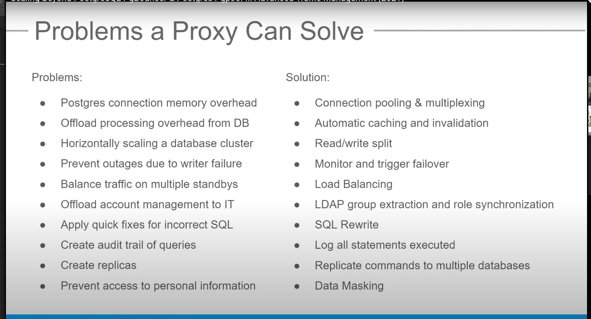

<h2>Why Connection Pooling?</h2>

PostgreSQL has a rather heavyweight connection handling architecture. For each incoming connection, the postmaster (the main Postgres daemon) forks out a new process (conventionally called a backend) to handle it. While this design provides better stability and isolation, it does not make it particularly efficient at handling short-lived connections. A new Postgres client connection involves TCP setup, process creation and backend initialization – all of which are costly in terms of time and system resources.

This of course is only a problem if connections are created too often and discarded without reuse. Unfortunately, it’s not uncommon to have a cluster of web nodes running applications written in PHP or other such languages that need to connect to the database once per page load. Batch jobs that rapidly make a bunch of connections in quick succession are also common. Employing connection pooling in such scenarios can drastically reduce the load on your PostgreSQL server and dramatically improve the query latencies.

With connection pooling, the clients connect to a proxy server which maintains a set of direct connections to the real PostgreSQL server. Typically, the clients do not (and should not) realize that they are connected to a proxy server rather than the actual server. The proxy may run on the same node as the client (example, on each web node), in which case the clients can connect to the proxy via Unix domain sockets which have very low connection overhead. Even if the proxy is on another node and the client needs a TCP connection to reach the proxy, the overhead of a new Postgres backend can be avoided.

<h2>Problem That a Proxy Solve:</h2>



<h2>What is PgBouncer?</h2>

PgBouncer is an open-source, lightweight, single-binary connection pooler for PostgreSQL. It can pool connections to one or more databases (on possibly different servers) and serve clients over TCP and Unix domain sockets.

PgBouncer maintains a pool of connections for each unique user, database pair. It’s typically configured to hand out one of these connections to a new incoming client connection, and return it back in to the pool when the client disconnects. You can configure PgBouncer to pool more aggressively, so that it can pick up and return the connection to the pool at transaction or statement boundaries rather than connection boundaries. There are some potentially undesirable consequences to those, however.

<h2>Installation:</h2>

PgBouncer depends on few things to get compiled:

* [GNU Make][1] 3.81+
* [Libevent][2] 2.0+
* [pkg-config][3]
* [OpenSSL][4] 1.0.1+ for TLS support
* (optional) [c-ares][5] as alternative to Libevent’s evdns
* (optional) PAM libraries

[1]:https://www.gnu.org/software/make/ "GNU MAKE"
[2]:https://libevent.org/ "Libevent"
[3]:https://www.freedesktop.org/wiki/Software/pkg-config/ "pkg-config"
[4]:https://www.openssl.org/ "OpenSSL"
[5]:https://c-ares.org/ "c-ares"

```
sudo sh -c 'echo "deb https://apt.postgresql.org/pub/repos/apt/ $(lsb_release -cs)-pgdg main" > /etc/apt/sources.list.d/pgdg.list'

wget --quiet -O - https://www.postgresql.org/media/keys/ACCC4CF8.asc | sudo apt-key add -

sudo apt-get update

sudo apt-get install pgbouncer

```


<h2>PG-Bouncer tutorial:</h2>


https://www.pgbouncer.org/usage.html
